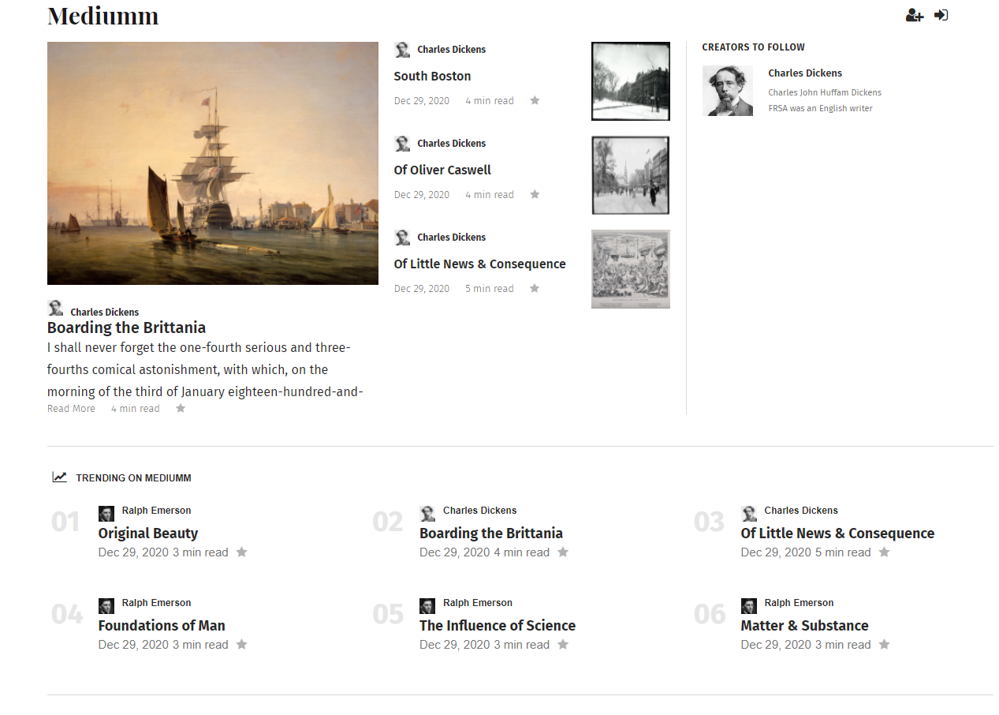

# Mediumm

Check out the app: [Live Demo](https://mediumm.herokuapp.com/)

## Table of Contents

* [Summary](#summary)
* [Features](#features)
* [MVPs](#mvps)
* [Application Structure](#Application-Structure)
* [Database Schema](#database-schema)

---

## **Summary**

* Mediumm is clone of [Medium](https://medium.com/)
* Mediumm is a web application that utilizes a Basic JavaScript, PUG template, Express architecture.

---

## **Features**

Medium allows users to:

* Create an account
* Log in / out
* Create a story
* Read stories
* Clap (like) a story
* Respond to stories
* Clap (like) a response
* Follow authors
* Modify their user profile
* View which stories have the most claps

---

## **MVPs**

* Authentication and Authorization

  * Uses Bcrypt hashing to authenticate users while not storing passwords in the database
  * Ensure that any personal information can only be obtained by themselves and nobody else

 

---

* Stories

  * Create / Read / Update / Delete Stories

 

---

* Responses

  * Create / Read / Delete Responses

* Claps

  * Able to clap a story
  * Able to clap a response

* Follows

  * Able to follow an author

---

## **Application Structure**

* **Back end**

  * The application's back end server was built using Express and utilizes Sequelize as the ORM for the PostgreSQL database.
  * It is a RESTful structure that accepts AJAX calls using JSON.
  * Server side rendering using PUG templating engine

* **Front end**

  * The front end is built using Basic JavaScript
  * Event listeners were used to give the web app a highly responsive design in order to give the user the best experience possible
  * Thorough logic was used to ensure that when a clap or follow occurred in one part of the app, that it dynamically changed everywhere on the app

* **Technologies**

  * [JavaScript](https://www.javascript.com/)
  * [Pugjs](https://pugjs.org/api/getting-started.html)
  * [Express.js](https://expressjs.com/)
  * [Node.js](https://nodejs.org/en/)
  * [Sequelize ORM](https://sequelize.org/)
  * [PostgreSQL](https://www.postgresql.org/)

---

## **Database Schema**

